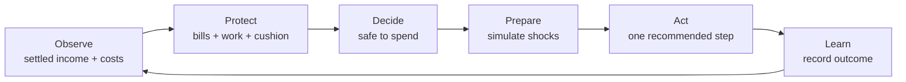
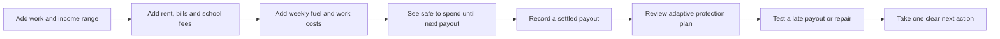
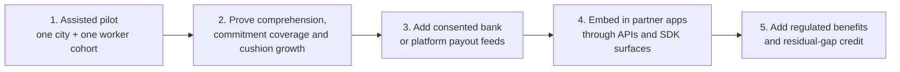
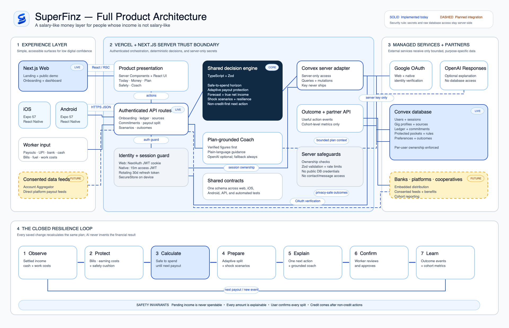
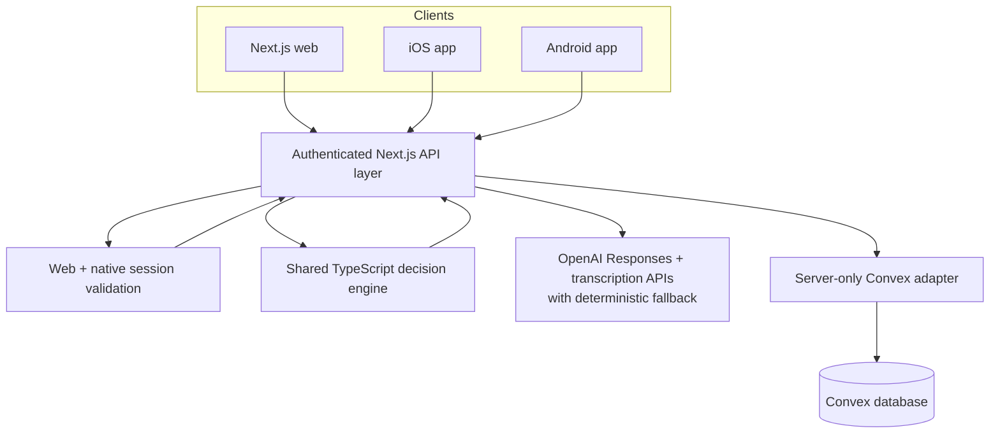

# SuperFinz

<p align="center">
  
</p>

<h2 align="center">Income changes. Bills do not.</h2>

<h3 align="center">A salary layer for people without salaries.</h3>

<p align="center">
  SuperFinz turns irregular earnings into one calm, explainable money plan:<br />
  protect the next bills, keep enough money to continue working, build a cushion, and show what is truly safe to spend.
</p>

<p align="center">
  
  
  
  
  
</p>

> **Innovation Unbound challenge:** How might banking technology help gig workers and people with irregular incomes build financial resilience through intelligent savings, responsible access to credit, and personalized financial guidance?

## Judge and investor snapshot

| Question | SuperFinz answer |
| --- | --- |
| **Who is it for?** | Gig, platform, freelance, daily-wage, and informal workers with irregular income |
| **What painful decision do they face?** | “How much can I use today without losing the money needed for bills or tomorrow's work?” |
| **What is broken today?** | Bank balances ignore obligations, monthly budgets assume salaries, trackers look backward, and credit arrives after distress |
| **What did we build?** | An adaptive income firewall that protects essentials and earning costs from settled income before revealing safe-to-spend money |
| **What is the wow moment?** | Add a late payout or ₹2,500 repair and the whole plan—safe amount, at-risk bills, cushion days, and next action—changes instantly |
| **Why is it credible?** | One deterministic TypeScript engine powers web, iOS, Android, the coach, simulations, and tested backend workflows |
| **How can it scale?** | B2B2C infrastructure for banks, worker platforms, cooperatives, and benefit providers, with privacy-safe outcome reporting |
| **How is it responsible?** | Expected income is never spent early; non-credit actions come before partner credit; every score and calculation is explainable |

### Read this repository in five minutes

1. [The problem we found](#the-problem-we-found)
2. [Our unique solution](#our-solution-the-adaptive-income-firewall)
3. [Why SuperFinz is different](#why-superfinz-is-different)
4. [The investor and partner case](#the-investor-and-partner-case)
5. [The 90-second demo](#90-second-judging-flow)
6. [Architecture and verification](#architecture)

## The 20-second pitch

A delivery partner may see ₹6,800 in the bank, but that is not ₹6,800 available to spend. Some of it already belongs to rent, fuel, an electricity bill, or the next week of work. Existing banking apps show the balance. Budgeting apps explain where money went. Credit apps offer a loan after the shortage appears.

**SuperFinz intervenes before the shortage.** It plans around the next likely payout, protects essential commitments and earning costs from money already received, and shows one number the worker can safely use without breaking the plan.

```text
Money available now
− protected bills due before the next payout
− money required to keep earning
− the worker's chosen safety buffer
= SAFE TO SPEND UNTIL THE NEXT PAYOUT
```

Expected income is shown as a range, but it never becomes spendable until it actually arrives.

## The problem we found

Gig workers do not primarily have an overspending problem. They have a **timing, uncertainty, and liquidity problem**.

- Earnings arrive on different days through platforms, UPI, bank transfers, and cash.
- Gross earnings hide fuel, maintenance, commissions, mobile data, and other costs required to keep working.
- Rent, school fees, utilities, family support, and EMIs stay fixed during a weak week.
- A late payout or vehicle repair can turn a manageable week into repeated short-term borrowing.
- A rigid monthly budget assumes a salary date and a predictable amount—two things many gig workers do not have.

The scale is material: NITI Aayog estimated 7.7 million Indian gig workers in 2020–21 and projected 23.5 million by 2029–30. A Bengaluru financial-diaries study by Dvara Research found high variation in both daily earnings and daily work expenses; in its small sample, 18 of 22 workers borrowed during the 14-day diary period, and 60% of the new loans were used for routine consumption smoothing. These figures are directional rather than population-wide, but they reveal the product gap clearly. Sources: [NITI Aayog](https://www.niti.gov.in/sites/default/files/2023-02/25th_June_Final_Report_27062022.pdf), [Dvara Research](https://dvararesearch.com/wp-content/uploads/2023/12/Research-Report_-The-financial-lives-of-platform-workers-A-diaries-study-in-Bengaluru-India.pdf).

### Evidence translated into product decisions

| Evidence | What it tells us | What SuperFinz does differently |
| --- | --- | --- |
| NITI Aayog projects the gig workforce to expand strongly through 2029–30 | This is a growing financial-services segment, not a temporary edge case | Builds a reusable irregular-income layer rather than a single-platform perk |
| Dvara's small Bengaluru sample averaged ₹35,075 in monthly platform earnings but ₹18,470 in work expenses, leaving ₹16,604 net | Gross payout is a dangerously weak proxy for household spending power | Shows gross earnings, earning costs, and true net income separately |
| The same diary study observed substantial day-to-day variation in both income and work expenses | A fixed monthly budget becomes stale during the month | Recomputes against the next likely payout and current obligations |
| 18 of 22 diary participants borrowed at least once; 60% of new loans were for routine consumption smoothing | Credit often treats the symptom after a timing gap appears | Predicts the gap and presents non-credit interventions first |
| CGAP platform pilots found value in small, automatic savings from actual earnings and also highlighted the importance of assisted engagement | Savings should follow real inflows, and digital-only onboarding is insufficient | Recommends a worker-confirmed amount per settled payout and supports simple, guided setup |

Sources: [NITI Aayog, *India's Booming Gig and Platform Economy*](https://www.niti.gov.in/sites/default/files/2023-02/25th_June_Final_Report_27062022.pdf), [Dvara Research, *The financial lives of platform workers*](https://dvararesearch.com/the-financial-lives-of-platform-workers-a-diaries-study-in-bengaluru-india/), [CGAP, *Regular Savings from Irregular Income*](https://www.cgap.org/blog/regular-savings-irregular-income-how-platforms-can-help).

### The failure chain

```text
Irregular payout timing
        +
Fixed household commitments
        +
Variable costs required to keep working
        ↓
The visible bank balance overstates usable money
        ↓
An essential bill or workday cost is accidentally consumed
        ↓
The worker delays payment, works unsustainably, or borrows for a routine gap
```

The intervention point is **before flexible spending**, not after the bill is missed.

### The people behind the numbers

| Worker situation | Existing decision | SuperFinz decision |
| --- | --- | --- |
| Delivery partner with weekly platform payouts | “My balance looks enough; can I spend ₹800 today?” | “₹620 is safe until Friday after rent and fuel are protected.” |
| Driver facing a repair | “Should I borrow ₹2,500 immediately?” | “Test the repair, reveal the verified gap, and try rescheduling or a short earning target first.” |
| Freelancer paid by multiple clients | “Which expected invoice can I count on?” | “Keep pending income separate and plan using a conservative range.” |
| Informal worker receiving cash | “Will the app work without a platform integration?” | “Record cash manually and use the same protection engine.” |

## The overlooked insight

Workers already try to **harden money**: mentally reserving part of a payout for rent, fuel, school fees, or an emergency before it disappears into daily spending.

SuperFinz turns that useful real-world behaviour into an adaptive digital system.

It does not force a salaried-person budget onto an irregular earner. It changes the planning clock from **“this month”** to **“until the next reliable payout.”**

## Our solution: the Adaptive Income Firewall

SuperFinz combines six capabilities into one decision loop.

### 1. Income Pulse

Records settled platform payouts, bank or UPI income, and manual cash income while keeping expected payouts visibly separate. It also separates gross earnings from work expenses to show true net earnings.

### 2. Safe Until Next Payout

Calculates a conservative safe-to-spend amount using only current liquid money. The card also explains the planning horizon, protected bills, required work costs, safety-buffer gap, data freshness, and expected-payout range.

### 3. Adaptive Payout Plan

When money arrives, SuperFinz recommends how to protect it in this order:

1. overdue and near-term essential commitments;
2. fuel, data, maintenance, and other earning-enabling costs;
3. the next day of emergency cushion;
4. longer-term savings;
5. flexible spending.

This is not a rigid 50/30/20 split. The recommendation changes with the actual payout, due dates, funded commitments, work needs, and current cushion. The worker reviews and confirms every allocation.

### 4. Plan Ahead and Slow-week Shield

One focused subpage keeps advanced planning off the everyday dashboard while
giving the worker four useful tools:

- a conservative 30-day runway with a visible safety floor;
- true take-home earnings after fuel, fees, data, and other work costs;
- one-tap slow-week scenarios that recalculate the whole plan; and
- a private, user-initiated summary to share with family or a counsellor.

The worker can test practical questions before making a decision:

- What if the next payout is late?
- What if next week's income falls?
- What if the vehicle needs a ₹2,500 repair?
- Can I take a day off?

The same calculation engine updates safe-to-spend, commitments at risk, cushion days, and the required earning target immediately.

### 5. Resilience Passport

An explainable planning indicator based on controllable financial factors such as commitment coverage, cushion depth, income-source concentration, income range, and work-cost control. It is explicitly **not** a bureau credit score and never uses contacts, messages, protected traits, or opaque platform ratings.

### 6. Plan-grounded Money Coach

The coach answers in short, plain language using the worker's saved plan. Financial numbers come from deterministic shared calculations—not from the language model. If AI is unavailable, the app returns a deterministic fallback instead of breaking the experience.

**Omni Coach makes that guidance usable without typing.** The worker can tap
the microphone, ask a question naturally, see the transcript, receive the same
plan-grounded answer, and listen to it aloud. Voice is always user-initiated,
limited to 30 seconds, and never written to the SuperFinz database. Text remains
visible and fully usable for people who cannot or prefer not to use audio.

### One engine, one continuous loop



The six capabilities are not disconnected features. A recorded cost changes the safe amount; the safe amount changes the payout recommendation; a simulated shock changes the next action; the coach explains those same calculated results; and outcome events tell a partner whether the intervention helped.

### How this answers the challenge statement

| Challenge requirement | SuperFinz implementation |
| --- | --- |
| **Financial resilience** | Protected commitments, earning-cost reserve, cushion days, shock planning, and outcome measurement |
| **Intelligent savings** | Adaptive, worker-confirmed protection from actual settled payouts instead of rigid monthly deductions |
| **Responsible credit** | Calculates the residual gap only after non-credit actions and requires regulated-partner disclosures |
| **Personalized guidance** | One best next step and a plan-grounded coach using the worker's own income range, bills, work costs, and goals |
| **Irregular income** | Next-payout horizon, multiple income sources, cash support, expected-versus-settled separation, and forecast ranges |

## Why SuperFinz is different

| Common approach | What it misses | SuperFinz response |
| --- | --- | --- |
| Expense tracker | Explains spending after it happens | Protects essential money before spending happens |
| Monthly budget | Assumes stable salary timing and amount | Plans until the next likely payout |
| Bank-balance dashboard | Treats the visible balance as usable money | Separates protected, required-to-earn, and safe money |
| Fixed percentage split | Ignores urgent bills and changing work costs | Adapts each payout to the worker's present situation |
| Income forecast | Can create false confidence | Shows a conservative range and does not spend it early |
| AI finance chatbot | Can produce fluent but ungrounded advice | Deterministic engine first; AI explains the verified plan |
| Credit-first gig fintech | Treats debt as the first intervention | Tries rescheduling, reallocation, cushion use, and an earning target first |
| Alternative credit score | Risks another opaque gatekeeper | Shows every factor and keeps the score out of automatic lending decisions |

> **Our novelty is not “safe to spend” by itself.** It is the closed loop that protects essential commitments and earning costs from every irregular inflow, adapts to the next payout horizon, tests shocks, and recommends non-credit actions before debt.

## A complete worker journey



The onboarding asks only for information that changes the plan. Advanced controls remain behind help panels or focused subpages so a first-time digital finance user is not overwhelmed.

## Product surfaces

SuperFinz is implemented as a responsive web product and a native Expo application for iOS and Android.

| Surface | What the worker can do |
| --- | --- |
| **Today** | See safe-to-spend, the safe-until date, expected payout range, protected money, and one best next step |
| **Money** | Record settled income or costs, see true net work earnings, manage income sources, and start a payout plan |
| **Plan** | Add rent, electricity, gas, education fees, or EMIs; mark them paid; and run shock scenarios |
| **Safety** | Track protected pockets, cushion days, resilience factors, and responsible-credit guardrails |
| **Plan ahead** | See a 30-day runway, true take-home earnings, test a slow week, and privately share a plan summary |
| **Coach** | Type or speak a question, receive an answer grounded in the same live plan, and listen to it aloud |
| **Settings** | Control profile, accessibility, alert preferences, split rules, and source consent |

### Designed for low digital confidence

- One primary decision per screen
- Plain words instead of banking jargon
- Large touch targets and clear back navigation
- Help beside unfamiliar concepts
- Progressive disclosure instead of crowded dashboards
- Larger-text, higher-contrast, and reduced-motion preferences
- Loading, empty, error, review, and undo states for financial actions
- Consistent experience across web, iOS, and Android

## The demo story

The public `/demo` route uses a fictional worker named Ravi and requires no sign-in.

Ravi has ₹6,800 available. SuperFinz protects his upcoming commitments, work costs, and safety buffer, then shows **₹620 safe until the next payout**. His expected ₹2,100–₹3,400 payout is visible but not counted. A judge can then plan a ₹3,200 settled payout or simulate a ₹2,500 repair and watch the recommended action change.

### 90-second judging flow

1. Open `/demo` and start on **Today**.
2. Expand **How is this calculated?** to prove the number is explainable.
3. Open **Money → Plan a payout**, enter ₹3,200, and review the adaptive allocation.
4. Open **Plan → What if income changes?** and select the ₹2,500 repair scenario.
5. Open **Safety** to show cushion days and transparent resilience factors.
6. Ask the **Coach** why the safe amount changed.

That sequence demonstrates one coherent decision engine—not a collection of disconnected screens.

### Hackathon evaluation map

| Evaluation lens | What to inspect in SuperFinz |
| --- | --- |
| **Problem understanding** | Research-backed timing and liquidity problem, gross-to-net gap, and worker money-hardening behaviour |
| **Innovation** | Adaptive income firewall, next-payout horizon, shock simulator, and non-credit-first intervention |
| **User impact** | One safe number, simple onboarding, work continuity, commitment protection, and cushion growth |
| **Technical execution** | Shared deterministic engine, Convex persistence, web + native apps, secure auth, APIs, and automated tests |
| **Feasibility** | Manual-input fallback today; consented bank and platform integrations through regulated partners later |
| **Scalability** | Cross-platform data model, shared contracts, partner metrics, B2B2C distribution, and cohort-level reporting |
| **Responsible design** | Explainable calculations, range forecasts, user confirmation, privacy boundaries, and honest prototype labels |

## What is real in this prototype

### Fully implemented

- Google authentication for web and native development builds
- Guided gig-worker onboarding
- Editable income, cost, commitment, pocket, source, and preference data
- Shared deterministic safe-to-spend and forecast calculations
- Adaptive payout recommendation, review, confirmation, and audit record
- Shock simulation and non-credit alternatives
- Explainable Resilience Passport
- Plan-grounded AI coach with deterministic fallback
- Convex persistence with per-user ownership checks
- Native access/refresh session rotation with hashed refresh tokens
- Public no-login demo
- End-to-end iOS and Android application surface through Expo

### Simulated and clearly labelled

- Platform account connections and automatic payout sync
- Account Aggregator or bank data integration
- Real movement of protected money between bank accounts
- Partner credit, insurance, and benefit eligibility

SuperFinz does **not** connect to a real bank, move money, approve credit, or issue a loan in this build.

## The investor and partner case

SuperFinz is more than a consumer budgeting interface. It can become the **decision and intervention layer between irregular income and financial products**.

### Why now

- India's gig workforce is projected to grow substantially, while most retail money tools still assume a monthly salary.
- Digital platform payouts create a natural moment to protect money immediately after it is earned.
- Banks and platforms need a way to support worker resilience without turning every cash-flow gap into a loan lead.
- RBI's digital-lending direction emphasizes clear cost disclosure, explicit consent, need-based data collection, and avoiding unsuitable nudges—principles that align with SuperFinz's non-credit-first design. See the [RBI Annual Report discussion of the Digital Lending Directions, 2025](https://www.rbi.org.in/scripts/AnnualReportPublications.aspx?Id=1436).

### Value created for every participant

| Stakeholder | Present problem | Value from SuperFinz |
| --- | --- | --- |
| **Worker** | Cannot distinguish account balance from usable money | Clear daily decision, fewer accidental shortfalls, stronger cushion, and control over every recommendation |
| **Bank or fintech** | Low engagement between transactions and limited context for responsible intervention | A consented resilience layer, deeper primary-account relevance, and outcome measures beyond product sales |
| **Gig platform** | Financial shocks reduce worker availability and trust | Better payout planning, work-cost continuity, and an employee-value proposition without becoming a lender |
| **Cooperative or worker organization** | Financial guidance is difficult to personalize at scale | Assisted onboarding plus a consistent, explainable plan for each member |
| **Regulated credit partner** | Loan amount may be based on a broad offer rather than the actual shortfall | A verified residual gap after non-credit options, with transparent disclosures and user choice |

### Proposed business model

The prototype has no commercial integration. The intended model is **B2B2C**, keeping the worker experience free or very low cost.

1. **Bank resilience module:** licensed dashboard and APIs embedded in a bank's mobile experience.
2. **Platform worker benefit:** per-active-worker access sponsored by delivery, mobility, home-service, or freelance platforms.
3. **Outcome-based pilots:** institutions pay for measured improvements such as commitment coverage or protected days—not for pushing loans.
4. **Regulated partner marketplace:** optional revenue share for suitable insurance, benefits, or credit only after transparent eligibility and worker consent. Loan lead generation is not the core model.

This aligns revenue with resilience and avoids depending on worker distress for growth.

### Defensibility

SuperFinz's moat is the combination of product behaviour, data structure, and distribution—not a generic chatbot.

- **Irregular-income decision engine:** one tested model connects payout timing, essential commitments, earning costs, protected pockets, scenarios, and actions.
- **Cross-platform neutrality:** platform payouts, UPI, bank income, freelance work, and cash can share one plan, reducing dependence on a single employer or data source.
- **Explainable outcome graph:** every recommendation can be traced to saved inputs, while outcome events measure what happened after the recommendation.
- **Shared multi-platform core:** the same contracts and calculations power web, iOS, Android, APIs, simulations, and coach context.
- **Responsible intervention policy:** non-credit-first ordering, forecast ranges, consent boundaries, and transparent scores are part of the system design rather than legal text added later.
- **Accessibility as distribution:** simple language and assisted onboarding make the product usable beyond digitally confident early adopters.

### Privacy-safe partner intelligence

An implemented partner endpoint reports aggregated measures such as active workers, commitment coverage, average protected days, work-cost ratio, shortfalls resolved without credit, payouts allocated, forecast accuracy, and recommended actions completed.

It enforces:

- API-key authentication;
- aggregate-only reporting;
- a minimum cohort of 10 workers;
- no worker-level surveillance;
- no punitive scoring;
- no credit-promotion notifications.

The implementation is in [`src/app/api/partner/metrics/route.ts`](src/app/api/partner/metrics/route.ts) and [`convex/gig.ts`](convex/gig.ts).

### Go-to-market



**Pilot hypothesis:** workers who see and act on a next-payout safe amount will protect more essential commitments and resolve more predicted shortfalls without emergency borrowing than workers using a balance-only experience.

The first pilot should combine the app with short in-person onboarding. CGAP's platform-worker work suggests that “tech and touch” together can matter for adoption; this is especially important for the low-digital-confidence users SuperFinz is designed to include.

### What we would prove in a pilot

| Dimension | Measure | Why an investor or partner should care |
| --- | --- | --- |
| Comprehension | Worker can correctly explain why safe-to-spend is lower than balance | Proves trust and usability |
| Resilience | Essential commitment coverage and protected cushion days | Measures financial health, not app engagement alone |
| Prevention | Predicted shortfalls resolved without credit | Demonstrates the core intervention thesis |
| Work continuity | Earning-enabling costs protected before the next payout | Connects financial resilience to worker availability |
| Forecast quality | Actual payouts inside the shown range | Calibrates the system without false precision |
| Retention | Workers return around payouts and bill due dates | Tests whether SuperFinz becomes a repeat financial habit |
| Partner value | Active workers and completed recommended actions in privacy-safe cohorts | Demonstrates scalable institutional value |

### Expansion path

The same engine can serve delivery partners, drivers, home-service professionals, freelancers, creators, commission earners, daily-wage workers, and micro-entrepreneurs. The inputs change, but the core problem remains: **income timing is uncertain while obligations are not.**

## Responsible finance by design

1. **Settled money only:** pending income never increases today's spendable balance.
2. **Ranges, not promises:** uncertain income is represented as a low–high estimate with confidence.
3. **Explain every number:** the inputs and protected amounts remain visible to the worker.
4. **User control:** payout allocations and source permissions require explicit confirmation.
5. **Non-credit first:** reschedule a flexible bill, reduce flexible allocation, set an earning target, or use only the necessary cushion before showing partner credit.
6. **No dark scoring:** the Resilience Passport is not a bureau score or an automatic lending decision.
7. **No invasive signals:** no contacts, messages, precise movement patterns, or protected traits are used.

## How the calculation works

The shared engine chooses the earliest upcoming active payout as the planning horizon. If no reliable payout exists, it uses a conservative seven-day horizon.

```text
unfunded essentials = essential bills due by the horizon − money already assigned
unfunded work costs = earning costs needed by the horizon − protected work money
safety gap         = chosen minimum buffer − current emergency cushion

protected money = protected pockets
                + unfunded essentials
                + unfunded work costs
                + safety gap

safe to spend = max(0, current balance − protected money)
```

The implementation clamps protected money to the current balance, avoids double-counting already funded commitments, and recalculates after every saved or deleted ledger entry. The core logic lives in [`packages/shared/src/gig.ts`](packages/shared/src/gig.ts) and is covered by deterministic tests in [`packages/shared/src/gig.test.ts`](packages/shared/src/gig.test.ts).

## Architecture

<p align="center">
  <a href="docs/architecture/superfinz-full-architecture.png">
    
  </a>
</p>

<p align="center"><sub>Click the diagram to open the full-resolution version.</sub></p>

### How to read the system

1. **Experience layer:** workers use the same simple product through Next.js web, native iOS, or native Android. Manual cash and payout entry works today; consented Account Aggregator and platform feeds are the planned scale path.
2. **Server trust boundary:** authenticated Next.js routes validate requests, enforce ownership, and call one shared TypeScript and Zod decision engine. No database or AI secret is shipped to a client.
3. **Decision core:** the deterministic engine calculates safe-to-spend, adaptive payout protection, forecasts, shock scenarios, resilience factors, and the next non-credit action. Web, mobile, APIs, and tests use the same contracts.
4. **Managed services:** Convex stores user-owned financial records and sessions. Google verifies identity. OpenAI can explain a bounded plan and transcribe a short, user-initiated voice question, but it cannot access the database or create financial figures; a deterministic fallback always remains available. Speech output uses the device's accessibility-friendly voice service.
5. **Closed resilience loop:** each settled payout or cost triggers the same sequence—observe, protect, calculate, prepare, explain, confirm, and learn—so every product surface stays synchronized.

**Use the diagram:** [edit in Excalidraw](docs/architecture/superfinz-full-architecture.excalidraw) · [download SVG for decks](docs/architecture/superfinz-full-architecture.svg) · [download PNG](docs/architecture/superfinz-full-architecture.png)

<details>
<summary><strong>Compact text version</strong></summary>



</details>

| Layer | Technology | Responsibility |
| --- | --- | --- |
| Web | Next.js 16, React 19 | Landing, public demo, onboarding, dashboard, authenticated API routes |
| Mobile | Expo SDK 57, Expo Router, React Native | Native iOS and Android experience |
| Shared core | TypeScript, Zod | Contracts, validation, safe-to-spend, forecast, payout, scenario, notification calculations |
| Database | Convex | Users, sessions, gig profiles, ledger, commitments, pockets, sources, rules, splits, preferences, outcomes |
| Web auth | NextAuth | Google OAuth and secure web session cookie |
| Native auth | Google Sign-In, JWT, SecureStore | Short access token and rotating refresh session |
| Coach | OpenAI Responses + transcription APIs, device TTS | Plan-grounded explanations with optional voice input and spoken output |

### Security boundaries

- Convex is accessed through a server-only adapter; its server key is never exposed to browsers or native clients.
- Every protected query and mutation validates the signed-in user and record ownership.
- Native refresh tokens are random, hashed at rest, rotated on use, revocable, and stored on-device with SecureStore.
- The AI coach receives a bounded plan summary rather than database credentials or unrestricted records.
- Voice recording starts only after a microphone tap, is capped at 30 seconds, is sent through an authenticated server route for transcription, and is not stored by SuperFinz.
- Secrets must never use `NEXT_PUBLIC_` or `EXPO_PUBLIC_` prefixes.

## Repository map

```text
innovation-unbound/
├── src/app/                  # Next.js pages and authenticated API routes
├── src/components/gig/       # Web gig-worker product surfaces
├── apps/mobile/src/app/      # Expo Router screens for iOS and Android
├── packages/shared/src/      # Shared schemas and deterministic finance engine
├── convex/                   # Database schema, queries, and atomic mutations
├── scripts/                  # Migration and end-to-end smoke checks
└── prisma/                   # Legacy PostgreSQL import source only
```

The running application reads and writes Convex. Legacy PostgreSQL tables remain only as an optional migration source.

## Key routes

| Route | Purpose |
| --- | --- |
| `/` | Product story and entry point |
| `/demo` | Complete Ravi demo without authentication |
| `/login` | Google sign-in and demo access |
| `/onboarding` | Irregular-income setup |
| `/dashboard` | Today and safe-to-spend |
| `/dashboard/income` | Cashbook, sources, and payout plan |
| `/dashboard/insights` | 30-day runway, true earnings, Slow-week Shield, and private summary |
| `/dashboard/plan` | Commitments, forecast, and scenarios |
| `/dashboard/safety` | Pockets, resilience, and credit guardrails |
| `/dashboard/coach` | Plan-grounded money coach |
| `/dashboard/settings` | Profile, preferences, consent, and split rule |

The equivalent native routes live under [`apps/mobile/src/app`](apps/mobile/src/app).

## Run locally

### Prerequisites

- Node.js 22.13 or newer
- A Convex project
- Google OAuth clients for the platforms being tested
- Xcode for iOS or Android Studio for Android native development builds

### Install

```bash
npm install
cp .env.example .env.local
cp apps/mobile/.env.example apps/mobile/.env
```

Fill the documented variables in both example files. Keep `OPENAI_API_KEY`, `SUPERFINZ_SERVER_KEY`, Google client secrets, and JWT secrets server-side.

Link the existing Convex project:

```bash
npx convex dev --configure existing --once
```

Start the web/API server and Expo in separate terminals:

```bash
npm run dev
npm run mobile
```

Open the native apps with:

```bash
npm run mobile:ios
npm run mobile:android
```

For a physical phone, `EXPO_PUBLIC_API_URL` must be a reachable LAN or HTTPS address. For the local iOS simulator, `http://127.0.0.1:3000` works when Next.js runs on port 3000. Native OAuth and EAS instructions are in [`MOBILE_SETUP.md`](MOBILE_SETUP.md).

The AI coach is optional for local development. Without `OPENAI_API_KEY`, the deterministic text fallback still returns an answer grounded in the current plan; voice transcription clearly reports that it is unavailable while typing continues to work.

## Verification

```bash
npm run typecheck
npm run lint
npm test
npm run test:convex
npm run build
cd apps/mobile && npx expo install --check
```

The shared tests verify safe-to-spend, funded-commitment handling, settled-versus-expected income, adaptive allocation, scenario changes, and non-promotional alerts. The Convex smoke test creates an isolated user and checks authentication, ownership, onboarding, cashbook changes, payout protection, preferences, outcome events, pocket updates, and native session rotation before removing the test data.

## Production path

The prototype deliberately proves the decision system before pretending integrations are live. A responsible production rollout would add:

1. consented financial data through a regulated Account Aggregator or bank partner;
2. direct platform payout feeds plus manual and cash fallback paths;
3. bank-held goal pockets or recurring sweep instructions with explicit confirmation;
4. multilingual and voice-assisted onboarding with field testing;
5. regulated benefit, insurance, and credit partners only after non-credit interventions;
6. longitudinal outcome measurement: commitments paid on time, cushion days gained, and credit avoided.

## Success metrics

SuperFinz should be judged on resilience outcomes, not screen time:

- percentage of essential commitments funded before due dates;
- protected days added to the emergency cushion;
- reduction in unexpected shortfalls;
- true net earnings visibility after work costs;
- workers who avoid or reduce unnecessary short-term borrowing;
- comprehension of the safe-to-spend explanation;
- successful independent use by low-digital-confidence workers.

---

<p align="center">
  <strong>SuperFinz does not ask, “Where did your money go?”</strong><br />
  It answers, <strong>“What can you safely do next?”</strong>
</p>

<p align="center">Built for Innovation Unbound · Financial Resilience for Gig and Informal Workers</p>
